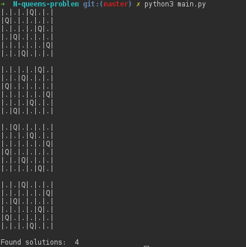

<!--
@Author: flo
@Date:   Sunday, March-12-2017, 22:28:59
@Email:  flo-github@outlook.fr
@Filename: README.md
@Last modified by:   flo
@Last modified time: Sunday, March-12-2017, 23:07:44
-->

# N-queens-problem

implementing the algorithm for resolve n-queens problem in Python3

## Usage:

### setting.py
- the file setting is option for choose the numbers of queens

### main.py
- python3 main.py

